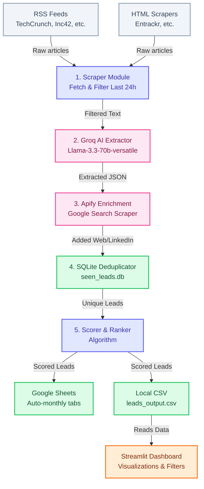

# Curato — Funding & Grant Intelligence Agent

An automated, intelligent Python agent that monitors startup funding news daily, extracts structured lead data using the **Groq AI** API, automatically finds the company's official website and LinkedIn using **Apify**, scores the leads, and writes the results to Google Sheets and a local CSV every morning at 9 AM.

It also includes a **Streamlit Dashboard** to filter, visualize, and explore the leads.

**Built for Curato** — a branding and marketing agency targeting companies that have just received funding and now have budget to invest in brand identity, websites, content, and growth marketing.

---

## 🏗️ Architecture & Workflow

The agent runs as a daily automated pipeline. Here is the high-level architecture of how data flows through the system:



---

## ✨ Features

- 📡 **Multi-source scraping** — TechCrunch, YourStory, Inc42, Entrackr, VCCircle, StartupNews.fyi, Startup India Blog
- 🧠 **Groq AI extraction** — Uses `llama-3.3-70b-versatile` to extract company name, funding type, amount, location, industry, and a custom "why this lead" pitch. Lightning fast and accurate.
- 🔎 **Apify Data Enrichment** — Uses Apify's Google Search Scraper to automatically find and attach the startup's official website URL and LinkedIn company page.
- 🎯 **Deterministic scoring** — 1–10 score based on funding stage, amount, and business logic.
- 🔁 **Deduplication** — SQLite-backed SHA-256 fingerprinting prevents repeat entries across runs.
- 📊 **Dual Output** — Writes natively to Google Sheets (auto-creating tabs per month) and a local CSV file.
- 📈 **Interactive Dashboard** — A beautiful Streamlit dashboard to explore, filter, and download leads.
- ☁️ **GitHub Actions Ready** — Fully configured to run daily at 9:00 AM IST via GitHub Actions CI/CD.

---

## 🛠️ Project Structure

```text
funding-agent/
├── .github/workflows/
│   └── daily_run.yml       # Cloud automation config
├── config/
│   └── sources.py          # RSS sources, scrape targets, keywords, score map
├── src/
│   ├── scraper.py          # RSS + HTML scraping
│   ├── extractor.py        # Groq AI lead extraction
│   ├── apify.py            # Apify Google search enrichment
│   ├── deduplicator.py     # SQLite-based deduplication
│   ├── scorer.py           # Deterministic scoring logic
│   ├── sheets.py           # Google Sheets + CSV output
│   └── pipeline.py         # Full pipeline orchestration
├── dashboard.py            # Streamlit frontend application
├── scheduler.py            # Local background scheduler
├── data/                   # Output folder (SQLite DB + CSV)
├── logs/                   # Auto-created timestamped run logs
├── requirements.txt
├── .env.example
└── README.md
```

---

## 🚀 Quick Start (Local)

### 1. Install Dependencies
```bash
pip install -r requirements.txt
```

### 2. Configure Environment
Copy the example file:
```bash
cp .env.example .env
```
Fill in `.env` with your API keys:
- **`GROQ_API_KEY`**: Your Groq API key for extraction.
- **`APIFY_API_TOKEN`**: Your Apify token for website/LinkedIn enrichment.
- **Google Sheets**: (Optional) `GOOGLE_SHEET_ID` and `GOOGLE_SERVICE_ACCOUNT_JSON` if you want cloud sheets output.

### 3. Run the Pipeline
Run a single immediate extraction:
```bash
python -m src.pipeline
```
Or start the local background scheduler (runs daily at 9 AM):
```bash
python scheduler.py
```

### 4. Launch the Dashboard
View your leads in the interactive frontend:
```bash
streamlit run dashboard.py
```

---

## ☁️ GitHub Actions Setup

You don't need to run this on your laptop! The repo includes a GitHub Actions workflow that runs automatically.

1. Push your code to a private GitHub repository.
2. Go to **Settings** → **Secrets and variables** → **Actions**.
3. Add the following repository secrets:
   - `GROQ_API_KEY`
   - `GOOGLE_SHEET_ID`
   - `GOOGLE_SERVICE_ACCOUNT_JSON` (Paste the entire JSON file contents)
   - `APIFY_API_TOKEN` *(Add this so the cloud runner can use Apify)*
4. The pipeline will now run every day at 9:00 AM IST (3:30 AM UTC) automatically!

---

## 🎯 Lead Scoring Logic

| Stage | Base Score |
|-------|-----------|
| Series B | 10 |
| Series A | 9 |
| Series C | 9 |
| Growth / Scale-Up | 8 |
| Seed | 7 |
| Strategic Investment | 7 |
| Venture Debt | 6 |
| Pre-Seed | 5 |
| Angel Investment | 4 |
| Grant (dynamic) | 3–8 based on amount |

**+1 bonus** if the company stage is explicitly "Growth" or "Scale". **Capped at 10**.

---

## 📝 Output Format

Whether in Google Sheets or the local CSV, leads are exported with these columns:
- Company Name
- Website *(Auto-enriched via Apify)*
- LinkedIn *(Auto-enriched via Apify)*
- Location
- Industry
- Company Stage
- Announcement Type
- Funding/Grant Amount
- Announcement Date
- Source URL
- Lead Score
- Why This Lead? *(AI-generated pitch)*
- Source Name
- Collected At
